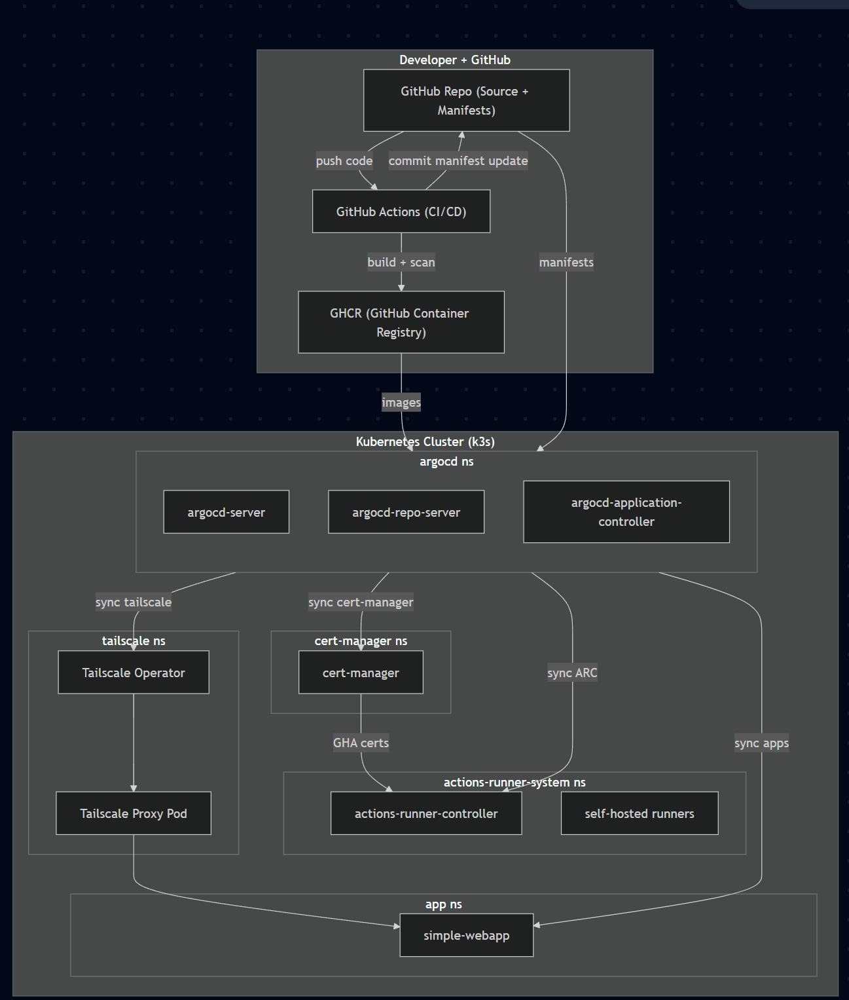

# On-Prem GitOps App Platform (Mini)


## Cluster Bootstrap Notes
* I decided to use k3s for setting up a local k8s cluster on my personal desktop computer inside of WSL (Windows Subsystem for Linux)
* I initially chose to start with an nginx-ingress controller, but moved to use Tailscale as it had easy to use hooks for exposing to external news with some TLS and DNS nice-ities

#### Initial setup
Used a make file for automating the k3s provisioning and setup. I disabled traefik as i dont want to use that ingress controller built into k3s. In addition to the k3s setup I added the following to the make file to initialize the k3s cluster
* Source and installed pertinent secrets from `.secrets.env.example` into k3s
* Sourced the kubeconfig into the users home directory for kube api access via local host
* Installed argocd into k3s, and intializing it with a root project and app, pointing to this publis repository

commands to setup the entirety of k3s for argocd hand-off. pre-reqs: `kubectl, cmake, curl`
```
cp .secrets.env.example .secrets.env
# Fill out .secrets.env with PAT token from github and OAUTH credentials from tailscale
make k3s-install
make argo-install
make secrets
```

Once these steps were complete, the rest of the service deployments were managed by using GitOps going forward from the `gitops/apps` directory and committing to the `main` branch

## Simple-webapp
I made a simple python flask app with some basic instrumention for prometheus  and the necessary readniess/liveness probes for k8s. I also added the `/info` path for the necessary requirements. Example json return from the python flask app running in my local k3s, networked via the tailscale operator.
The url is `https://simple-webapp.tail948a3d.ts.net/info` which is publicly accessible when k3s is spun up

```
curl https://simple-webapp.tail948a3d.ts.net/info
{"app":"simple-webapp","build_sha":"sha256:b33c61641a24a56fff02ccec5d4e7809cd258a22185a4105c4c698be2d701126","timestamp":"2025-08-20T03:25:25.167367+00:00"}
```
#### Helm
I used a helm chart to ArgoCD deploy this simple-webapp from the directory gitops/helm/simple-webapp. Some key notes:
* I pinned the helm chart to use the `sha:` digest for pulling images
* I forced the container to use nonRoot and to run as a specific numeric user
* I removed the automounting of service account tokens and gave no RBAC to the service account
* I adjusted resources and requests on the deployments along with a default HPA setup (80% usage)

## Container Build
I set up automation to build the container image in the `apps/simple-webapp` directory, either locally with Docker or through a GitHub Actions workflow.

* The image is built with a non-privileged numeric user, which matches the user specified in the Helm chart deployment spec.
* the `.github/workflows/build.yaml` file contains the working automated builds
* This build pipeline performs trivy scanning (non blocking), basic test of spinning up and hiting the container with an API call, push image to GHCR
* leverages the `sha:` digest and commits it into the helm chart values, which then inturn updates the digest in k3s via gitops automatically

## Other Items of note
* Leveraged the Tailscale kubernetes operator (installed via ArgoCD) and configured tailscale to leverage magic DNS and TLS to allow for public access of the ingress
  * When my k3s cluster is spun up, the url is [https://simple-webapp.tail948a3d.ts.net/info](https://simple-webapp.tail948a3d.ts.net/info)
* I kept all my secrets local to my machine to initialize in k3s, and did not pass secrets via CI. This was the easiest way to prevent committing secrets but there are more mature way of doing this
* Added self hosted runners in the same k3s cluster by using the `actions-runner-controller` operator. This is working by having a ephermeral pods in k3s be a target for a GHA jobs. Confirmed working in my personal github account
  * found in `gitops/apps/self-hosted-runners.yaml` and `gitops/apps/arc-runners`
  * A dependency was `cert-manager` so that was also installed

# Architecture
